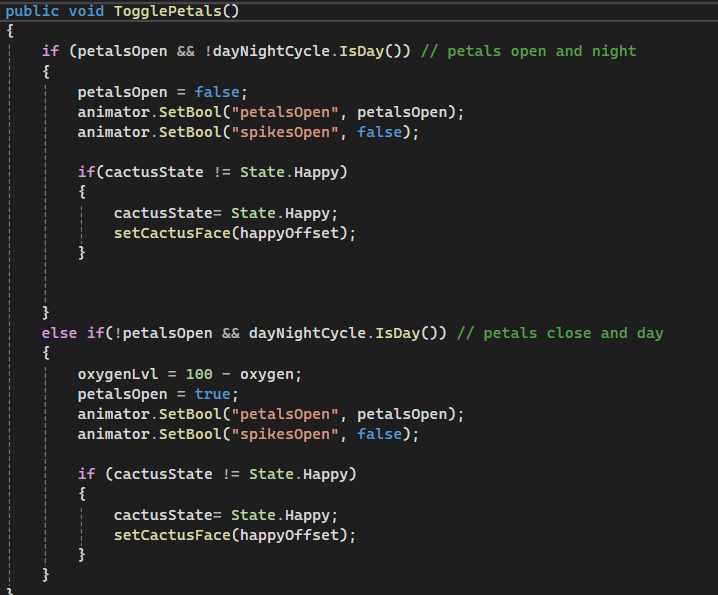
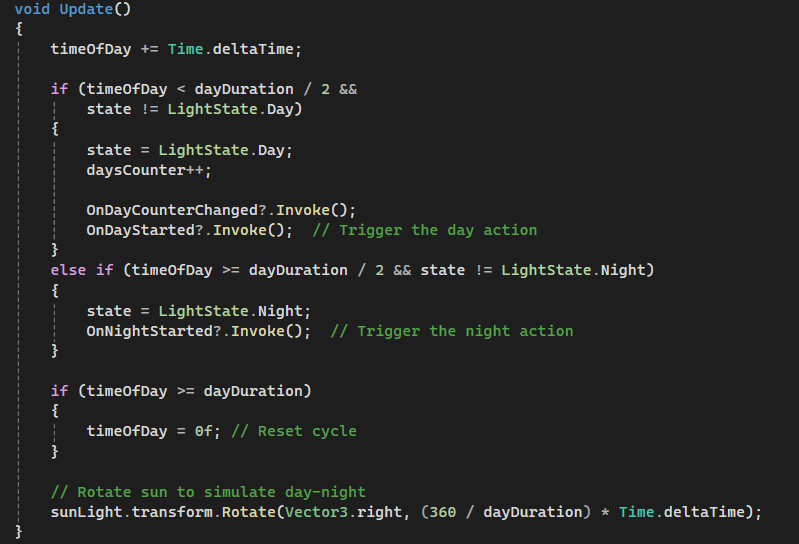
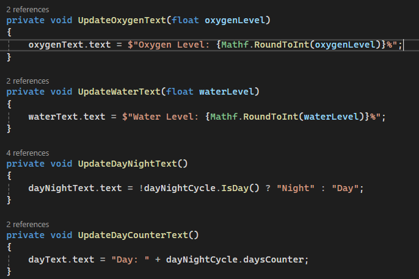
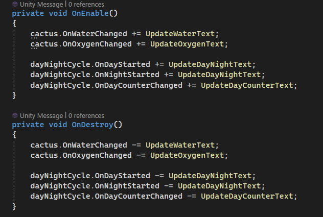

# 🌵 Cactus Treatment Simulator

A Unity-based simulation game created for in3D Tech. This project showcases a cactus's lifecycle influenced by environmental parameters like water and oxygen. Designed with Unity's Universal Render Pipeline (URP), this project includes animations, custom shaders, particle effects, and a user-friendly GUI.

---

## 🎮 Features

- **Dynamic Lifecycle Simulation**:
  - The cactus's state (happy/sad) changes based on water and oxygen levels.
  - Visual feedback includes animations, particle effects, and facial expression changes.
  
  

   *Example of cactus state changes based on parameters.*

- **Manual and Automatic Interactions**:
  - Players can manually adjust water and oxygen levels.
  - Automatic day/night cycle impacts the cactus's needs.
  
  

  *The day/night cycle in action.*

- **Custom Shaders**:
  - Unique shaders for visual effects, including a custom face texture for the cactus.
  - Shader to simulate environmental changes.

- **Responsive UI**:
  - UI elements update dynamically to reflect water and oxygen levels.
  - Day/night cycle visually represented in the interface.

  
  

  *Dynamic UI updating in real-time.*

- **Event-Driven Architecture**:
  - Actions and events handle state changes for clean and scalable code.

---

## 🛠️ Technologies and Tools

- **Unity Version**: 2023.x (or compatible version)
- **Rendering Pipeline**: Universal Render Pipeline (URP)
- **Programming Language**: C#
- **Frameworks and Libraries**: 
  - Unity Event System
  - Unity Animator
- **Design Patterns**: 
  - Event-Driven Architecture
  - Modular Design

---

## 🎥 Demo

[Click here to watch the video](https://youtu.be/_hg1RfpmOCM)
